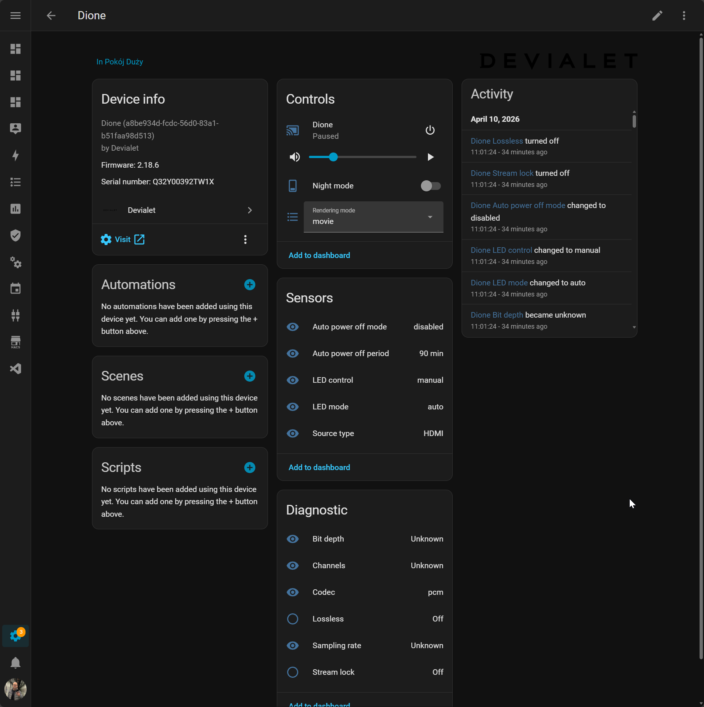

# Devialet for Home Assistant

[](https://hacs.xyz/)
[](https://github.com/EvotecIT/homeassistant-devialet/actions/workflows/validate.yml)
[](https://github.com/EvotecIT/homeassistant-devialet/actions/workflows/hassfest.yml)

Local-first Devialet support for Home Assistant, focused on reliability, clean setup, and controls that actually match what the speaker exposes on your network.



## 🎯 What This Is

This project is a custom Home Assistant integration for Devialet speakers that expose the local IP Control API.

Today the strongest real-world validation is on:

- Devialet Dione

The goal is broader Devialet support over time, while keeping the integration stable and practical for everyday Home Assistant use.

## ✨ What You Get

- local discovery and config flow setup
- media player controls
- source selection
- volume and mute
- Dione features such as `night mode` and `rendering mode`
- useful diagnostics and stream metadata

## 🏠 Installation

### HACS

1. Open HACS.
2. Add `https://github.com/EvotecIT/homeassistant-devialet` as a custom repository of type `Integration`.
3. Install `Devialet`.
4. Restart Home Assistant.
5. Go to `Settings -> Devices & services` and add `Devialet`.

### Manual

1. Copy the `custom_components/devialet` folder into your Home Assistant `config/custom_components` directory.
2. Restart Home Assistant.
3. Add the integration from `Settings -> Devices & services`.

## ✅ Current Status

- best support today: Devialet Dione
- local API confirmed and tested against Dione firmware `2.18.6`
- structured so more Devialet models can be added as we confirm their local behavior

The current investigation notes are in `docs/devialet-dione-investigation.md`.

## 🧱 Project Structure

This repo is intentionally split into two layers:

- a reusable Python protocol/client layer for talking to Devialet locally
- the Home Assistant integration layer built on top of it

That keeps the code easier to test and also leaves a path toward extracting a standalone Python library later.

## 🛣️ Roadmap

- expand writable settings safely after endpoint confirmation
- improve support for additional Devialet models
- keep aligning with Home Assistant best practices
- eventually extract the protocol layer into a reusable Python package if it stabilizes enough

## 🛠️ Development

```bash
python -m pip install -e .[test]
ruff check .
python -m compileall custom_components tests
pytest
```

Note:

- the full Home Assistant pytest stack runs best in Linux CI
- on Windows, `pytest-homeassistant-custom-component` imports `fcntl`, so complete local HA pytest runs are limited

## ❤️ Support

- Issues: [GitHub Issues](https://github.com/EvotecIT/homeassistant-devialet/issues)
- Source: [GitHub Repository](https://github.com/EvotecIT/homeassistant-devialet)
