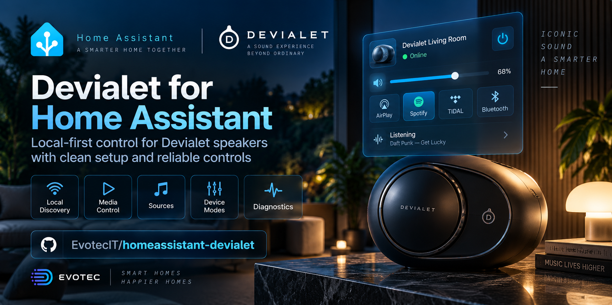
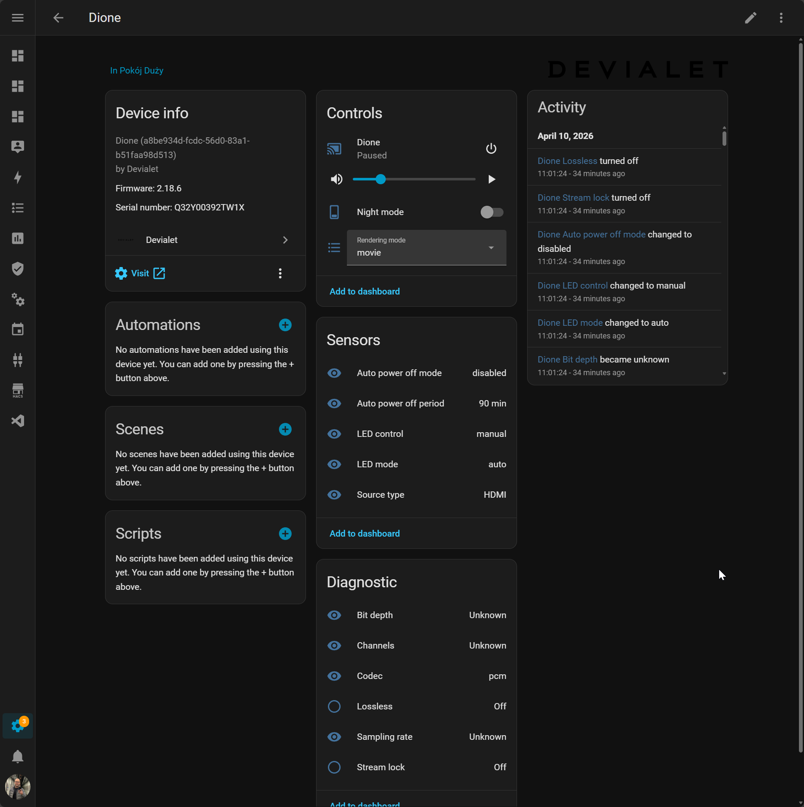

# Devialet for Home Assistant

## Overview

Control Devialet speakers and soundbars through their local IP Control API.
The integration adds discovery, a media player, and the settings advertised by
the device.

- Volume, mute, source selection, and supported playback controls.
- Dione settings such as night mode, rendering mode, LEDs, and auto power-off.
- Bluetooth pairing and optional diagnostic entities.

**Dione has the strongest real-device validation.** Other models must expose a
compatible local API; they are not guaranteed to provide Dione's settings.
See [device support](docs/device-support.md) before relying on model-specific
features.

## Sponsor

Support development and maintenance through
[GitHub Sponsors](https://github.com/sponsors/PrzemyslawKlys).
Sponsorship is optional; these projects remain open source.

## More for your Home Assistant home

Other integrations and dashboards we maintain:

- [Dreame & MOVA mowers](https://github.com/EvotecIT/homeassistant-dreamelawnmower) — Mowing controls, maps, schedules, and supported cameras.
- [Lawn Mower Card](https://github.com/EvotecIT/lovelace-lawn-mower-card) — A dashboard for mower state, maps, and controls.
- [KEF](https://github.com/EvotecIT/homeassistant-kef) — Local control for modern and legacy speaker families.
- [Siegenia](https://github.com/EvotecIT/homeassistant-siegenia) — Local control for supported window controllers.
- [EasyControlX](https://github.com/EvotecIT/homeassistant-easycontrolx) — Connect supported Windows and macOS hosts.

For a native app connected to the same Home Assistant setup:

- [CasaRay](https://casaray.dev/) — rooms, devices, cameras, and home activity on
  iPhone, iPad, and Mac.
- [Tactra Remote](https://tactra.dev/) — media players, speakers, and TV controls
  on iPhone, iPad, Apple Watch, and Mac.

Neither app is required to use this project.

## Installation

### HACS

1. Open the repository with the button above. Alternatively, in HACS choose
   **Custom repositories**, add `https://github.com/EvotecIT/homeassistant-devialet`,
   and select **Integration**.
2. Download **Devialet** and restart Home Assistant.
3. Open **Settings → Devices & services → Add integration**, then choose
   **Devialet**.

### Manual

1. Download the repository and copy `custom_components/devialet` into your
   Home Assistant `config/custom_components` directory.
2. Restart Home Assistant.
3. Add **Devialet** from **Settings → Devices & services**.

## Configuration

Accept a discovered device or enter its host/IP address and local API port.
The default port is **80**. Home Assistant must be able to reach the speaker
on your local network.

Open the device page to find the media player and supported settings. Use
**Configure** to adjust polling and optional setting sensors, or **Reconfigure**
to update the network address.

## Documentation

| I want to… | Guide |
| --- | --- |
| Check model support and limitations | [Device support](docs/device-support.md) |
| Configure the device or troubleshoot connectivity | [Configuration](docs/configuration.md) |
| Automate playback, volume, or settings | [Automations](docs/automations.md) |
| Use Devialet from Python | [Python library](docs/python-library.md) |
| Contribute or investigate a device | [Development](docs/development.md) · [Open work](docs/feature-checklist.md) |

## Screenshots

## Support

[Report an issue](https://github.com/EvotecIT/homeassistant-devialet/issues)
with the model, firmware, integration version, and the action that failed.
Download diagnostics and review attachments for personal information before
posting. Include whether the same operation works in the vendor app.
